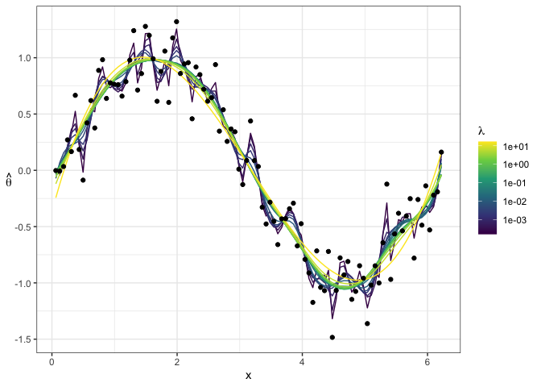
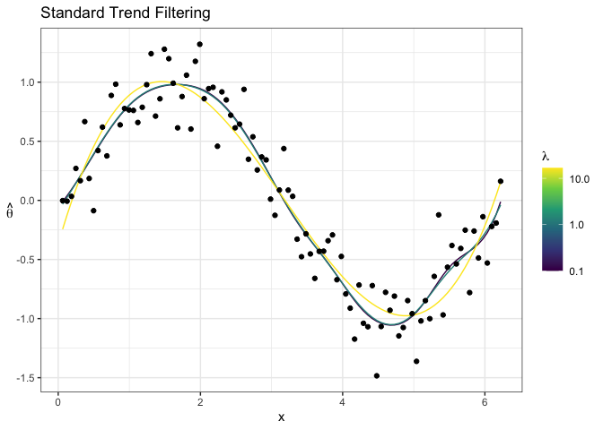
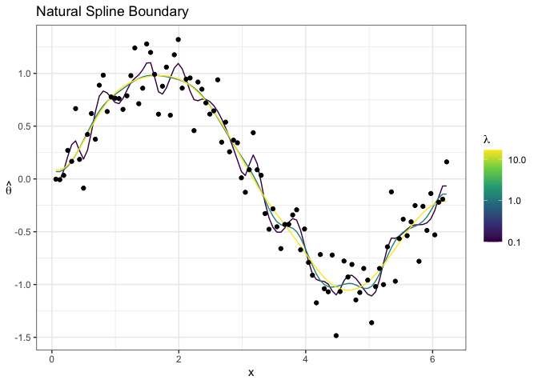
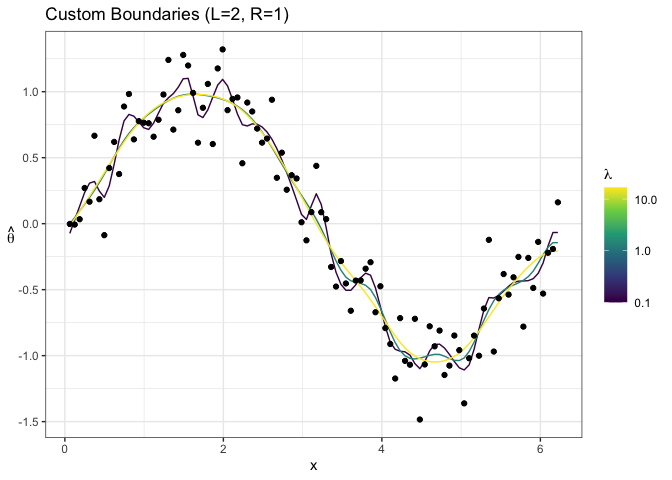

<!-- README.md is generated from README.Rmd. Please edit that file -->

# trendfilter

<!-- badges: start -->

[](https://github.com/glmgen/trendfilter/actions/workflows/R-CMD-check.yaml)
<!-- badges: end -->

The goal of trendfilter is to **solve** nonparametric regression.

## Installation

You can install the development version of trendfilter from
[GitHub](https://github.com/) with:

``` r
# install.packages("remotes")
remotes::install_github("zhoumo2716/trendfilter")
#> Downloading GitHub repo zhoumo2716/trendfilter@HEAD
#> 
#> ── R CMD build ─────────────────────────────────────────────────────────────────
#> * checking for file ‘/private/var/folders/74/4fh__5010_l3tp8fpsft2ft00000gn/T/RtmpQIsEHU/remotes100d52ac7815f/zhoumo2716-trendfilter-1cdc5d0/DESCRIPTION’ ... OK
#> * preparing ‘trendfilter’:
#> * checking DESCRIPTION meta-information ... OK
#> * cleaning src
#> * checking for LF line-endings in source and make files and shell scripts
#> * checking for empty or unneeded directories
#> * building ‘trendfilter_0.0.2.9002.tar.gz’
#> Installing package into '/private/var/folders/74/4fh__5010_l3tp8fpsft2ft00000gn/T/Rtmpymb2M6/temp_libpathfbad592a4767'
#> (as 'lib' is unspecified)
#pak::pak("zhoumo2716/trendfilter")
```

## Example

This is a basic example which shows you how to solve a common problem:

``` r
library(trendfilter)
library(ggplot2)
x <- 1:100 / 101 * 2 * pi
y <- sin(x) + .2 * rnorm(100)
out <- trendfilter(y, x, nlambda = 15)
plot(out) +
  geom_point(data = data.frame(x = x, y = y), aes(x, y), color = "black")
```



## Boundary Condition Option

`boundary_condition = TRUE` enables boundary correction using Newton
polynomials and divided differences. `left_boundary_m` and
`right_boundary_m` determine how the boundary conditions are applied
(order of polynomial). By default, `left_boundary_m` =
`right_boundary_m` = `round(k/2)`, which simplifies to (k+1)/2 when k is
odd (natural spline at the boundary).

``` r

# Standard trend filtering (without boundary conditions)
out1 <- trendfilter(y, x, nlambda = 3, lambda_min = 0.1)
plot(out1) +
  ggtitle("Standard Trend Filtering") +
  geom_point(data = data.frame(x = x, y = y), aes(x, y), color = "black")
```



``` r

# Trend filtering with natural spline boundary conditions
out2 <- trendfilter(y, x, nlambda = 3, lambda_min = 0.1, boundary_condition = TRUE)
plot(out2) +
  ggtitle("Natural Spline Boundary") +
  geom_point(data = data.frame(x = x, y = y), aes(x, y), color = "black")
```



``` r

# Custom boundary conditions
out3 <- trendfilter(y, x, nlambda = 3, lambda_min = 0.1, boundary_condition = TRUE, left_boundary_m = 2, right_boundary_m = 1)
plot(out3) +
  ggtitle("Custom Boundaries (L=2, R=1)") +
  geom_point(data = data.frame(x = x, y = y), aes(x, y), color = "black")
```


